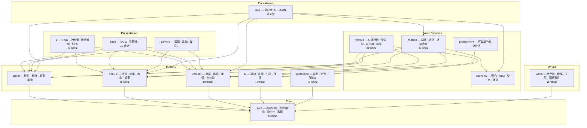
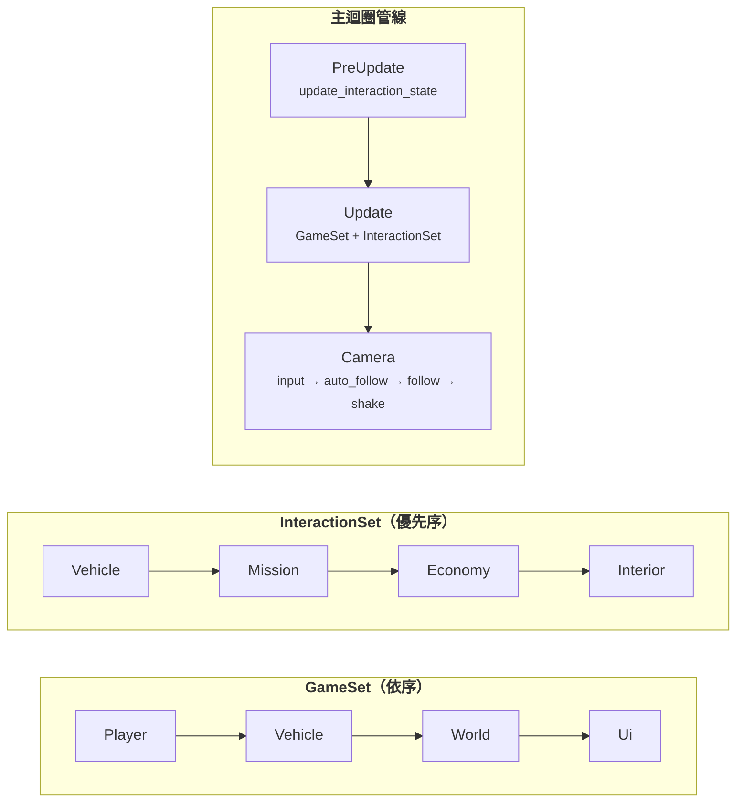
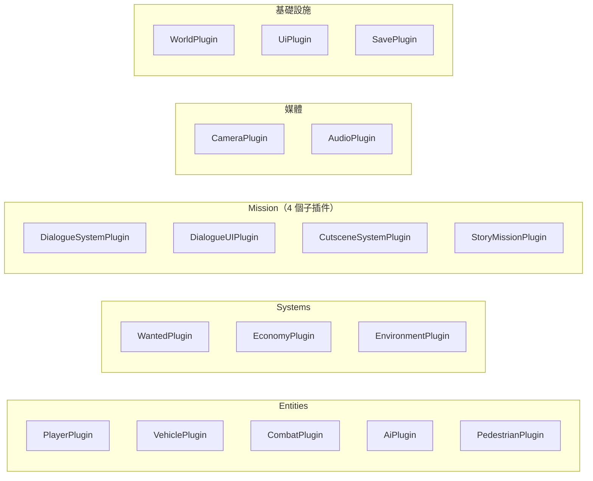

---
paths:
  - "src/main.rs"
  - "src/*/mod.rs"
  - "src/lib.rs"
---

# 架構圖

## 分層架構

## 系統執行順序

暫停控制：`.run_if(|ui: Res<UiState>| !ui.paused)`

## 17 個 Bevy Plugins

> 全部 17 個模組皆使用 Plugin 形式，統一在 `main.rs` 中以 `.add_plugins()` 註冊。
