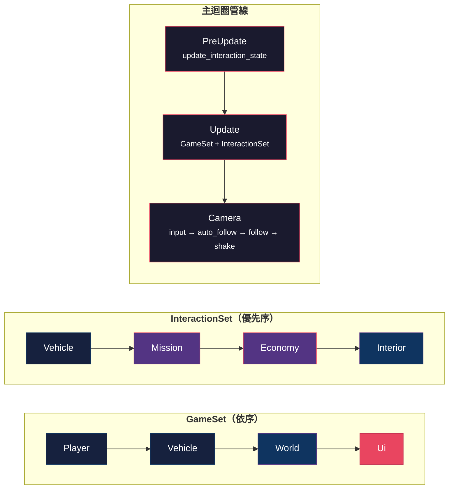
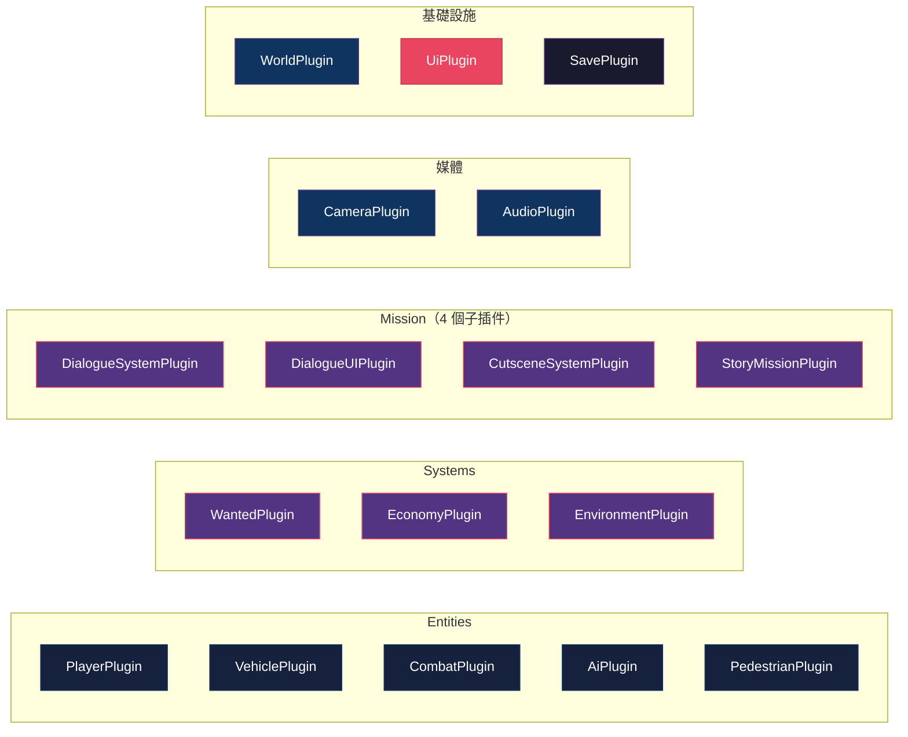

# CLAUDE.md

Claude Code 在此專案中的工作指引。

## AI 助理技能

撰寫程式碼前，參閱 `.agent/skills/` 中的專門指南：

| 技能       | 路徑                                           |
|----------|----------------------------------------------|
| Rust 專家  | `.agent/skills/rust-expert/SKILL.md`         |
| Bevy 架構師 | `.agent/skills/bevy-architect/SKILL.md`      |
| 遊戲數學與物理  | `.agent/skills/game-math-physicist/SKILL.md` |
| 資源管理員    | `.agent/skills/asset-manager/SKILL.md`       |

## 專案概述

**島嶼狂飆 (Island Rampage)** — 以台灣西門町為舞台的 GTA 風格 3D 開放世界動作遊戲。

| 技術               | 版本           | 用途       |
|------------------|--------------|----------|
| Rust             | 2021 Edition | 程式語言     |
| Bevy             | 0.17         | ECS 遊戲引擎 |
| bevy_rapier3d    | 0.32         | 3D 物理引擎  |
| serde/serde_json | 1.0          | 存檔系統     |

**規模**：251 個 .rs 檔案、83,149 行代碼、804 個單元測試、0 clippy warnings

## 常用指令

```bash
cargo dev                    # 開發模式（含 dev_tools，見 .cargo/config.toml）
cargo run                    # 開發模式（不含 dev_tools）
cargo run --release          # 發布模式（最佳效能，不含 dev_tools）
cargo check                  # 編譯檢查
cargo test                   # 執行 804 個單元測試
cargo test economy::tests    # 特定模組測試
cargo clippy                 # 靜態分析
cargo fmt                    # 格式化
```

## 開發工具

### Debug 模式專用工具

條件編譯：`#[cfg(all(debug_assertions, feature = "dev_tools"))]`

| 工具              | 按鍵 | 位置        | 說明                     |
|-----------------|----|-----------|------------------------|
| World Inspector | -  | 全螢幕       | 即時編輯實體/組件（dev 模式常駐）    |
| FPS Counter     | -  | 左上角       | 綠(>60)/黃(30-60)/紅(<30) |
| AI Debug        | F3 | -         | AI 視野/聽覺範圍             |
| Debug Viz       | F4 | -         | 警察視野/路徑/恐慌範圍           |
| Rapier Debug    | -  | 場景中       | 綠色碰撞箱線框                |
| Entity Names    | -  | Inspector | 每秒自動命名（英文）             |

**Gizmos 可視化**：
- 警察 FOV 錐 - 綠色扇形（半徑：`PoliceConfig.vision_range`）
- 視線狀態 - 紅（看見）/灰（未看見）
- A* 路徑 - 藍色折線 + 黃色球（waypoints）
- 恐慌範圍 - 黃色圓圈（半徑 10m）

### 開發工具模式

```rust
// Timer-based system（非關鍵 debug 功能）
#[derive(Resource)]
pub struct MyDebugTimer { timer: Timer }

app.init_resource::<MyDebugTimer>()
   .add_systems(Update, (
       update_timer,
       debug_system.run_if(|t: Res<MyDebugTimer>| t.timer.just_finished()),
   ).chain());

// Toggle-based system（F3 類按鍵切換）
#[derive(Resource, Default)]
pub struct DebugState { pub enabled: bool }

app.init_resource::<DebugState>()
   .add_systems(Update, debug_viz.run_if(|s: Res<DebugState>| s.enabled));
```

### UI 位置慣例

- **左上角**：Debug 資訊（FPS、座標等）
- **右上角**：小地圖（避免放置其他 UI）
- **中下**：通緝等級、武器、血量

## 架構

### 分層架構


### 系統執行順序



暫停控制：`.run_if(|ui: Res<UiState>| !ui.paused)`

### 17 個 Bevy Plugins



> 全部 17 個模組皆使用 Plugin 形式，統一在 `main.rs` 中以 `.add_plugins()` 註冊。

### 關鍵模式

#### 1. Bevy 0.17 Message 模式

```rust
// Plugin::build()
app.add_message::<DamageEvent>();

// 系統中
fn my_system(mut events: MessageReader<DamageEvent>) {
    for event in events.read() { ... }
}
```

#### 2. 空間哈希網格（O(1) 鄰近查詢）

位於 `core/spatial_hash.rs`，三個預定義網格：

| 資源                      | 網格大小  | 用途     |
|-------------------------|-------|--------|
| `VehicleSpatialHash`    | 15.0m | 行人碰撞檢測 |
| `PedestrianSpatialHash` | 10.0m | 恐慌波傳播  |
| `PoliceSpatialHash`     | 20.0m | 玩家偵測   |

```rust
fn my_system(mut grid: ResMut<VehicleSpatialHash>) {
    grid.clear();                                    // 每幀清空
    grid.insert(entity, transform.translation);      // 插入
    let nearby = grid.query_radius(center, 10.0);    // 查詢 O(k)
}
```

#### 3. 物件池（碎片）

位於 `environment/components.rs`，兩階段獲取確保安全重用：

```rust
if let Some(entity) = pool.acquire() {
    if let Ok((mut debris, ...)) = query.get_mut(entity) {
        pool.confirm_acquire(entity);  // 確認
    }
}
```

#### 4. 距離平方優化

永遠使用 `distance_squared` 搭配預計算常數：

```rust
const ALERT_DISTANCE_SQ: f32 = 1600.0;  // 40m
if pos1.distance_squared(pos2) < ALERT_DISTANCE_SQ { ... }
```

#### 5. Query 衝突解決

多個 Query 存取相同組件時，使用 `Without<T>` 消除歧義：

```rust
pub fn system(
    player: Query<&Transform, With<Player>>,
    heli: Query<&Transform, (With<PoliceHelicopter>, Without<Player>)>,
    spotlight: Query<&mut Transform, (With<Spotlight>, Without<Player>, Without<PoliceHelicopter>)>,
)
```

#### 6. SystemParam 模式（超過 16 個參數）

```rust
#[derive(SystemParam)]
pub struct DamageSystemResources<'w> {
    combat_state: ResMut<'w, CombatState>,
    // ...多個 resource 欄位
}

pub fn damage_system(res: DamageSystemResources, query: Query<...>) { ... }
```

## 代碼質量規範

> 基於 2026-02 code review 建立的規範，確保長期可維護性。

### 檔案大小限制

**硬性限制**：
- 單一檔案不得超過 **800 行**（含註解、空行）
- 超過 500 行應考慮是否需要分割

**分割原則**：
1. **按職責分割**：每個檔案應專注於單一概念或功能
2. **使用子模組**：創建 `module_name/` 目錄並用 `mod.rs` 重新匯出
3. **保持測試同步**：分割時確保單元測試一併移動

**範例**（已完成的重構）：
```
# Before (❌ God Object)
src/vehicle/vehicle_damage.rs  (1,171 行)

# After (✅ 單一職責)
src/vehicle/vehicle_damage/
  ├── mod.rs              (重新匯出)
  ├── health.rs           (血量、輪胎狀態)
  ├── fire.rs             (引擎起火系統)
  ├── explosion.rs        (爆炸條件與效果)
  └── collision.rs        (碰撞傷害計算)
```

### `#![allow(dead_code)]` 使用規則

**禁止**：
- ❌ 整個模組使用 `#![allow(dead_code)]` 而不註解原因
- ❌ 用來隱藏真正應該刪除的死代碼

**允許**：
- ✅ 預留的功能模組（必須註解說明未來用途）
- ✅ 公開 API 設計（暫未整合但已規劃）
- ✅ 測試輔助函數

**範例**：
```rust
// ✅ 正確：有註解說明
#![allow(dead_code)]  // 天氣效果系統預留，將於 v0.5 整合

// ❌ 錯誤：無註解
#![allow(dead_code)]
```

### 模組依賴規則

**分層依賴**（參考架構圖）：
1. **向下依賴**：高層可依賴低層（Presentation → Entities → Core）
2. **禁止向上依賴**：Core 不得依賴 Entities 或 Systems
3. **橫向依賴最小化**：同層模組間盡量避免直接依賴

**跨模組通訊**：
- ✅ **優先使用 Events**：解耦模組間通訊
- ✅ **Resource 作為共享狀態**：明確的資料來源
- ❌ **避免直接修改其他模組的 Resource**：應透過 Events 通知

**範例**：
```rust
// ✅ 好的設計：使用 Event
#[derive(Message)]
pub struct MissionCompletedEvent {
    pub reward: u32,
}

// economy 模組監聽 Event
fn handle_mission_reward(
    mut events: MessageReader<MissionCompletedEvent>,
    mut wallet: ResMut<PlayerWallet>,
) {
    for event in events.read() {
        wallet.add_cash(event.reward as i32);
    }
}

// ❌ 壞的設計：直接修改
fn mission_system(
    mut wallet: ResMut<PlayerWallet>,  // 跨模組直接依賴
) {
    wallet.add_cash(100);  // mission 不應直接操作 economy 的 Resource
}
```

### 測試要求

**新功能必須包含測試**：
- **核心邏輯**：所有計算、狀態轉換必須有單元測試
- **公開 API**：所有 `pub fn` 應有測試覆蓋
- **邊界條件**：測試極值、空值、錯誤情況

**測試組織**：
```rust
// 方案 A：小型模組（<200 行）- 測試寫在同檔案
#[cfg(test)]
mod tests {
    use super::*;

    #[test]
    fn test_damage_calculation() { ... }
}

// 方案 B：大型模組 - 獨立 tests.rs
src/ui/
  ├── mod.rs
  ├── notification.rs
  └── tests.rs  // #[cfg(test)] mod tests;
```

**測試覆蓋率目標**：
- 核心系統（combat, economy, ai）：> 80%
- UI 和呈現層：> 60%
- 整體專案：> 75%

### 性能考量

#### Clone 使用指引

**避免不必要的克隆**：
```rust
// ❌ 壞：每次都克隆
for item in items.iter() {
    process(item.clone());  // 如果 process 不需要所有權，應傳引用
}

// ✅ 好：傳引用
for item in items.iter() {
    process(item);
}
```

**使用 `Arc<T>` 共享大型數據**：
```rust
// ❌ 壞：頻繁克隆大型結構
#[derive(Clone)]
pub struct MissionData {
    pub dialogue: Vec<DialogueLine>,  // 可能很大
    pub cutscenes: Vec<Cutscene>,
}

// ✅ 好：使用 Arc 共享
pub struct MissionData {
    pub dialogue: Arc<Vec<DialogueLine>>,
    pub cutscenes: Arc<Vec<Cutscene>>,
}
```

**何時使用 Clone**：
- ✅ 小型 Copy 類型（`u32`, `f32`, `Vec3` 等）
- ✅ 需要修改而不影響原始數據
- ✅ Bevy 組件（通常需要 Clone）
- ❌ 大型 Vec、String（考慮引用或 Arc）

#### 錯誤處理

**避免 `unwrap()` 在非測試代碼**：
```rust
// ❌ 壞：可能 panic
let player = player_query.single().unwrap();

// ✅ 好：優雅處理
let Ok(player) = player_query.single() else {
    warn!("Player not found, skipping update");
    return;
};
```

**使用場景**：
- ✅ `#[cfg(test)]` 測試代碼
- ✅ 初始化保證存在的資源（加 `// SAFETY:` 註解）
- ❌ 遊戲運行時邏輯

### 提交規範

**Commit 訊息格式**：
```
<type>(<scope>): <subject>

<body>

Co-Authored-By: Claude Sonnet 4.5 <noreply@anthropic.com>
```

**Type 類型**：
- `feat`: 新功能
- `fix`: 錯誤修復
- `refactor`: 重構（不改變功能）
- `test`: 新增或修改測試
- `docs`: 文檔更新
- `perf`: 性能優化
- `style`: 格式調整
- `chore`: 建置或工具變更

**範例**：
```
refactor(vehicle): split vehicle_damage.rs into 4 focused modules

將 1,171 行的 vehicle_damage.rs 重構為：
- health.rs: 血量和輪胎狀態管理
- fire.rs: 引擎起火系統
- explosion.rs: 爆炸觸發與效果
- collision.rs: 碰撞傷害計算

所有 41 個車輛測試通過 ✓

Co-Authored-By: Claude Sonnet 4.5 <noreply@anthropic.com>
```

### 測試覆蓋

| 模組                 | 測試數     | 覆蓋範圍                     |
|--------------------|---------|--------------------------|
| combat             | 130     | 武器、傷害、護甲、布娃娃、出血、自動瞄準     |
| vehicle            | 108     | 血量、輪胎、交通燈、改裝、爆炸、水上載具     |
| economy            | 107     | 錢包、商店、ATM、股市、賭場、企業       |
| ui                 | 74      | 通知、互動提示、手機、股市、改裝商店、存檔 UI |
| mission            | 69      | 任務目標、評分、對話、劇情、支線         |
| pedestrian         | 67      | 恐慌波、尋路、目擊者、行為、游泳         |
| camera             | 48      | pitch 限制、距離調整、角度正規化      |
| audio              | 39      | 電台系統、音量、淡入淡出             |
| player             | 38      | 攀爬、技能、角色切換               |
| ai                 | 32      | 狀態轉換、感知、逃跑               |
| save               | 31      | 序列化、存檔路徑                 |
| wanted             | 27      | 通緝等級、警察狀態、搜索區            |
| world/time_weather | 13      | 日照、天氣光照、天體、霓虹燈、窗戶        |
| core/spatial_hash  | 12      | 插入、查詢、邊界                 |
| environment        | 9       | 可破壞物件、碎片池                |
| **合計**             | **804** |                          |

## 關鍵檔案速查

| 系統      | 檔案                                                                 |
|---------|--------------------------------------------------------------------|
| 空間哈希    | `src/core/spatial_hash.rs`                                         |
| 戰鬥插件    | `src/combat/mod.rs`                                                |
| 傷害計算    | `src/combat/damage/` (calculation, death, effects, reactions)      |
| 射擊系統    | `src/combat/shooting/` (input, firing, effects)                    |
| 爆炸物     | `src/combat/explosives/` (systems, explosion, effects)             |
| 掩體      | `src/combat/cover.rs`                                              |
| 警用直升機   | `src/wanted/police_helicopter/` (components, spawning, ai, combat) |
| 偷車      | `src/vehicle/theft.rs`                                             |
| 車輛改裝    | `src/vehicle/modifications/` (performance, visuals, systems)       |
| 車輛效果    | `src/vehicle/effects.rs`                                           |
| 行人生命週期  | `src/pedestrian/systems/lifecycle.rs`                              |
| 恐慌系統    | `src/pedestrian/panic.rs`                                          |
| 目擊者系統   | `src/pedestrian/systems/witnesses.rs`                              |
| 世界生成    | `src/world/setup/`                                                 |
| 天氣效果    | `src/world/time_weather/weather_effects.rs`                        |
| 可破壞物件   | `src/environment/systems.rs`                                       |
| 股票市場    | `src/economy/stock_market.rs`                                      |
| 賭場      | `src/economy/casino.rs`                                            |
| 手機 UI   | `src/ui/phone.rs`, `phone_apps.rs`, `phone_apps_stock.rs`          |
| 改裝商店 UI | `src/ui/mod_shop.rs`                                               |
| 車內電台    | `src/audio/integration.rs`, `src/audio/components.rs`              |

## 操作方式

| 按鍵    | 步行              | 駕駛       |
|-------|-----------------|----------|
| WASD  | 移動              | 轉向/加速    |
| Space | 跳躍              | 煞車       |
| Shift | 衝刺              | 氮氣       |
| Q/E   | 斜向前進            | 上/下一電台   |
| F     | 互動（上下車/任務/商店/門） | 下車       |
| X     | 偷車（按住）          | -        |
| R     | 射擊              | 車上射擊     |
| T     | 換彈              | -        |
| G     | 投擲爆炸物           | -        |
| H     | 引爆手榴彈           | -        |
| 1-4   | 切換武器            | 選電台（1-8） |
| 5-7   | 切換角色（龍/美/財）     | 選電台（1-8） |
| 9     | -               | 關閉電台     |
| Tab   | 武器輪盤            | -        |
| V     | 切換視角            | 切換視角     |
| C     | 電影鏡頭模式          | -        |
| M     | 地圖              | 地圖       |
| O     | 外送 App          | -        |
| Y     | 投降（按住）          | -        |
| B     | 賄賂目擊者           | -        |
| ↑     | 開關手機            | 開關手機     |
| F7    | 存檔選單            | 存檔選單     |
| F5/F9 | 快速存/讀檔          | 快速存/讀檔   |
| Esc   | 暫停              | 暫停       |

### 開發專用

| 按鍵 | 功能                       |
|----|--------------------------|
| F3 | 切換 AI Debug 可視化          |
| F4 | 切換通緝系統 Debug 可視化（Gizmos） |

## 驗證

```bash
cargo check && cargo test && cargo clippy
```

## 常見問題

### Bevy 0.17 特殊性

- `on_timer()` 不存在 - 使用自訂 `Timer` resource + `run_if(|t: Res<T>| t.timer.just_finished())`
- FPS 顯示 - `DiagnosticsStore` + `FrameTimeDiagnosticsPlugin::FPS`
- Query 單一結果 - `query.single()` 取代 `get_single()`（Bevy 0.16 → 0.17）

### 開發工具整合

- **FlyCam 衝突**：與自訂 camera_follow 系統衝突，已移除
- **Inspector 中文亂碼**：預設字體不支援中文，實體命名使用英文
- **Gizmos 性能**：預設每幀繪製，大量物件時用 `run_if` 條件執行或 F3 切換
- **條件編譯**：所有 dev tools 模組需加 `#[cfg(all(debug_assertions, feature = "dev_tools"))]`

### 測試

- 804 個單元測試覆蓋核心系統
- 修改後必跑：`cargo test`（~0.01s）
- 建置時間：37-84 秒（動態連結）
