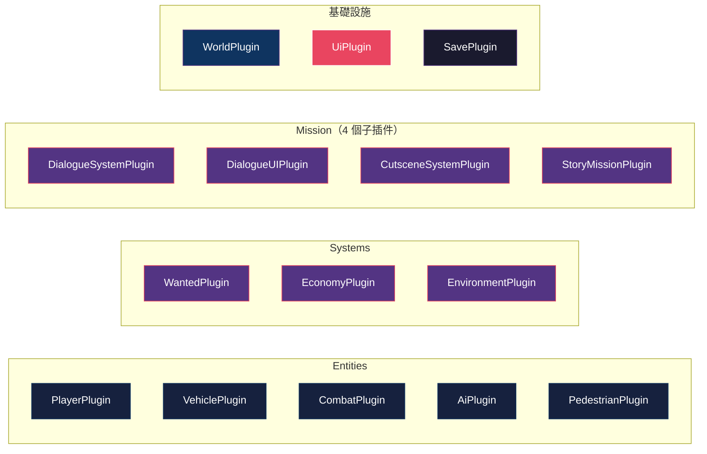

# CLAUDE.md

Claude Code 在此專案中的工作指引。

## AI 助理技能

撰寫程式碼前，參閱 `.agent/skills/` 中的專門指南：

| 技能       | 路徑                                           |
|----------|----------------------------------------------|
| Rust 專家  | `.agent/skills/rust-expert/SKILL.md`         |
| Bevy 架構師 | `.agent/skills/bevy-architect/SKILL.md`      |
| 遊戲數學與物理  | `.agent/skills/game-math-physicist/SKILL.md` |
| 資源管理員    | `.agent/skills/asset-manager/SKILL.md`       |

## 專案概述

**島嶼狂飆 (Island Rampage)** — 以台灣西門町為舞台的 GTA 風格 3D 開放世界動作遊戲。

| 技術               | 版本           | 用途       |
|------------------|--------------|----------|
| Rust             | 2021 Edition | 程式語言     |
| Bevy             | 0.17         | ECS 遊戲引擎 |
| bevy_rapier3d    | 0.32         | 3D 物理引擎  |
| serde/serde_json | 1.0          | 存檔系統     |

**規模**：140 個 .rs 檔案、~62,800 行、335 個單元測試、0 clippy warnings

## 常用指令

```bash
cargo dev                    # 開發模式（含 dev_tools，見 .cargo/config.toml）
cargo run                    # 開發模式（不含 dev_tools）
cargo run --release          # 發布模式（最佳效能，不含 dev_tools）
cargo check                  # 編譯檢查
cargo test                   # 執行 335 個單元測試
cargo test economy::tests    # 特定模組測試
cargo clippy                 # 靜態分析
cargo fmt                    # 格式化
```

## 開發工具

### Debug 模式專用工具

條件編譯：`#[cfg(all(debug_assertions, feature = "dev_tools"))]`

| 工具 | 按鍵 | 位置 | 說明 |
|------|------|------|------|
| World Inspector | F7 | 全螢幕 | 即時編輯實體/組件 |
| FPS Counter | - | 左上角 | 綠(>60)/黃(30-60)/紅(<30) |
| Debug Viz | F3 | - | 警察視野/路徑/恐慌範圍 |
| Rapier Debug | - | 場景中 | 綠色碰撞箱線框 |
| Entity Names | - | Inspector | 每秒自動命名（英文） |

**Gizmos 可視化**：
- 警察 FOV 錐 - 綠色扇形（半徑：`PoliceConfig.vision_range`）
- 視線狀態 - 紅（看見）/灰（未看見）
- A* 路徑 - 藍色折線 + 黃色球（waypoints）
- 恐慌範圍 - 黃色圓圈（半徑 10m）

### 開發工具模式

```rust
// Timer-based system（非關鍵 debug 功能）
#[derive(Resource)]
pub struct MyDebugTimer { timer: Timer }

app.init_resource::<MyDebugTimer>()
   .add_systems(Update, (
       update_timer,
       debug_system.run_if(|t: Res<MyDebugTimer>| t.timer.just_finished()),
   ).chain());

// Toggle-based system（F3 類按鍵切換）
#[derive(Resource, Default)]
pub struct DebugState { pub enabled: bool }

app.init_resource::<DebugState>()
   .add_systems(Update, debug_viz.run_if(|s: Res<DebugState>| s.enabled));
```

### UI 位置慣例

- **左上角**：Debug 資訊（FPS、座標等）
- **右上角**：小地圖（避免放置其他 UI）
- **中下**：通緝等級、武器、血量

## 架構

### 分層架構

```mermaid
graph TD
    subgraph L5["<b>Presentation</b>"]
        ui["ui — HUD · 小地圖 · 武器輪盤 · GPS<br><small>18 個檔案</small>"]
        audio["audio — BGM · 引擎聲 · 3D 音效"]
        camera["camera — 跟隨 · 震動 · 後座力"]
    end

    subgraph L4["<b>Game Systems</b>"]
        wanted["wanted — 5 星通緝 · 警車 AI · 直升機 · 路障<br><small>11 個檔案</small>"]
        mission["mission — 劇情 · 對話 · 過場動畫<br><small>15 個檔案</small>"]
        economy["economy — 商店 · ATM · 金錢"]
        env["environment — 可破壞物件 · 碎片池"]
    end

    subgraph L3["<b>Entities</b>"]
        player["player — 移動 · 跳躍 · 閃避 · 攀爬"]
        vehicle["vehicle — 物理 · 偷車 · 改裝 · 效果<br><small>10 個檔案</small>"]
        combat["combat — 射擊 · 爆炸 · 掩體 · 布娃娃<br><small>13 個檔案</small>"]
        ai_mod["ai — 感知 · 決策 · 小隊 · 掩護<br><small>11 個檔案</small>"]
        ped["pedestrian — 尋路 · 恐慌 · 目擊者<br><small>13 個檔案</small>"]
    end

    subgraph L2["<b>World</b>"]
        world["world — 西門町 · 建築 · 天氣 · 隨機事件<br><small>10 個檔案</small>"]
    end

    subgraph L1["<b>Core</b>"]
        core["core — AppState · 空間哈希 · 物件池 · 數學<br><small>8 個檔案</small>"]
    end

    subgraph L0["<b>Persistence</b>"]
        save["save — 非同步 IO · JSON 序列化"]
    end

    ui & audio & camera --> player & vehicle & combat
    wanted --> player & vehicle & combat & ai_mod
    mission --> player & vehicle & combat & economy
    env --> combat
    player & vehicle & combat & ai_mod & ped --> core
    world --> core
    save --> player & vehicle & combat & economy & mission

    style core fill:#1a1a2e,stroke:#e94560,color:#fff
    style player fill:#16213e,stroke:#0f3460,color:#fff
    style vehicle fill:#16213e,stroke:#0f3460,color:#fff
    style combat fill:#16213e,stroke:#0f3460,color:#fff
    style ai_mod fill:#16213e,stroke:#0f3460,color:#fff
    style ped fill:#16213e,stroke:#0f3460,color:#fff
    style world fill:#0f3460,stroke:#533483,color:#fff
    style wanted fill:#533483,stroke:#e94560,color:#fff
    style mission fill:#533483,stroke:#e94560,color:#fff
    style economy fill:#533483,stroke:#e94560,color:#fff
    style env fill:#533483,stroke:#e94560,color:#fff
    style ui fill:#e94560,stroke:#fff,color:#fff
    style audio fill:#e94560,stroke:#fff,color:#fff
    style camera fill:#e94560,stroke:#fff,color:#fff
    style save fill:#1a1a2e,stroke:#533483,color:#fff
```



### 系統執行順序


暫停控制：`.run_if(|ui: Res<UiState>| !ui.paused)`

### 16 個 Bevy Plugins



> `audio` 和 `camera` 的系統直接註冊在 `main.rs`，未使用 Plugin 形式。

### 關鍵模式

#### 1. Bevy 0.17 Message 模式

```rust
// Plugin::build()
app.add_message::<DamageEvent>();

// 系統中
fn my_system(mut events: MessageReader<DamageEvent>) {
    for event in events.read() { ... }
}
```

#### 2. 空間哈希網格（O(1) 鄰近查詢）

位於 `core/spatial_hash.rs`，三個預定義網格：

| 資源                      | 網格大小  | 用途     |
|-------------------------|-------|--------|
| `VehicleSpatialHash`    | 15.0m | 行人碰撞檢測 |
| `PedestrianSpatialHash` | 10.0m | 恐慌波傳播  |
| `PoliceSpatialHash`     | 20.0m | 玩家偵測   |

```rust
fn my_system(mut grid: ResMut<VehicleSpatialHash>) {
    grid.clear();                                    // 每幀清空
    grid.insert(entity, transform.translation);      // 插入
    let nearby = grid.query_radius(center, 10.0);    // 查詢 O(k)
}
```

#### 3. 物件池（碎片）

位於 `environment/components.rs`，兩階段獲取確保安全重用：

```rust
if let Some(entity) = pool.acquire() {
    if let Ok((mut debris, ...)) = query.get_mut(entity) {
        pool.confirm_acquire(entity);  // 確認
    }
}
```

#### 4. 距離平方優化

永遠使用 `distance_squared` 搭配預計算常數：

```rust
const ALERT_DISTANCE_SQ: f32 = 1600.0;  // 40m
if pos1.distance_squared(pos2) < ALERT_DISTANCE_SQ { ... }
```

#### 5. Query 衝突解決

多個 Query 存取相同組件時，使用 `Without<T>` 消除歧義：

```rust
pub fn system(
    player: Query<&Transform, With<Player>>,
    heli: Query<&Transform, (With<PoliceHelicopter>, Without<Player>)>,
    spotlight: Query<&mut Transform, (With<Spotlight>, Without<Player>, Without<PoliceHelicopter>)>,
)
```

#### 6. SystemParam 模式（超過 16 個參數）

```rust
#[derive(SystemParam)]
pub struct DamageSystemResources<'w> {
    combat_state: ResMut<'w, CombatState>,
    // ...多個 resource 欄位
}

pub fn damage_system(res: DamageSystemResources, query: Query<...>) { ... }
```

### 測試覆蓋

| 模組                 | 測試數     | 覆蓋範圍              |
|--------------------|---------|-------------------|
| combat             | 88      | 武器、傷害、護甲、布娃娃、出血   |
| economy            | 47      | 錢包、商店、ATM         |
| pedestrian         | 43      | 恐慌波、尋路、目擊者、行為、動畫  |
| vehicle            | 41      | 血量、輪胎、交通燈、改裝、爆炸   |
| ai                 | 26      | 狀態轉換、感知、逃跑        |
| wanted             | 22      | 通緝等級、警察狀態、搜索區     |
| save               | 17      | 序列化、存檔路徑          |
| mission            | 15      | 任務目標、評分、競速、計程車    |
| world/time_weather | 13      | 日照、天氣光照、天體、霓虹燈、窗戶 |
| core/spatial_hash  | 12      | 插入、查詢、邊界          |
| player/climb       | 5       | 攀爬類型、緩動函數         |
| **合計**             | **329** |                   |

## 關鍵檔案速查

| 系統     | 檔案                                          |
|--------|---------------------------------------------|
| 空間哈希   | `src/core/spatial_hash.rs`                  |
| 戰鬥插件   | `src/combat/mod.rs`                         |
| 傷害計算   | `src/combat/damage/` (calculation, death, effects, reactions) |
| 射擊系統   | `src/combat/shooting/` (input, firing, effects) |
| 爆炸物    | `src/combat/explosives.rs`                  |
| 掩體     | `src/combat/cover.rs`                       |
| 警用直升機  | `src/wanted/police_helicopter.rs`           |
| 偷車     | `src/vehicle/theft.rs`                      |
| 車輛改裝   | `src/vehicle/modifications.rs`              |
| 車輛效果   | `src/vehicle/effects.rs`                    |
| 行人生命週期 | `src/pedestrian/systems/lifecycle.rs`       |
| 恐慌系統   | `src/pedestrian/panic.rs`                   |
| 目擊者系統  | `src/pedestrian/systems/witnesses.rs`       |
| 世界生成   | `src/world/setup.rs`                        |
| 天氣效果   | `src/world/time_weather/weather_effects.rs` |
| 可破壞物件  | `src/environment/systems.rs`                |

## 操作方式

| 按鍵    | 步行              | 駕駛    |
|-------|-----------------|-------|
| WASD  | 移動              | 轉向/加速 |
| Space | 跳躍              | 煞車    |
| Shift | 衝刺              | 氮氣    |
| Q/E   | 斜向前進            | -     |
| F     | 互動（上下車/任務/商店/門） | 下車    |
| X     | 偷車              | -     |
| R     | 換彈              | -     |
| G     | 投擲爆炸物           | -     |
| 1-4   | 切換武器            | -     |
| Tab   | 武器輪盤            | -     |
| M     | 地圖              | 地圖    |
| Esc   | 暫停              | 暫停    |

### 開發專用

| 按鍵 | 功能 |
|------|------|
| F3 | 切換 Debug 可視化（Gizmos） |
| F7 | 開啟 World Inspector |

## 驗證

```bash
cargo check && cargo test && cargo clippy
```

## 常見問題

### Bevy 0.17 特殊性

- `on_timer()` 不存在 - 使用自訂 `Timer` resource + `run_if(|t: Res<T>| t.timer.just_finished())`
- FPS 顯示 - `DiagnosticsStore` + `FrameTimeDiagnosticsPlugin::FPS`
- Query 單一結果 - `query.single()` 取代 `get_single()`（Bevy 0.16 → 0.17）

### 開發工具整合

- **FlyCam 衝突**：與自訂 camera_follow 系統衝突，已移除
- **Inspector 中文亂碼**：預設字體不支援中文，實體命名使用英文
- **Gizmos 性能**：預設每幀繪製，大量物件時用 `run_if` 條件執行或 F3 切換
- **條件編譯**：所有 dev tools 模組需加 `#[cfg(all(debug_assertions, feature = "dev_tools"))]`

### 測試

- 335 個單元測試覆蓋核心系統
- 修改後必跑：`cargo test`（~0.01s）
- 建置時間：37-84 秒（動態連結）
