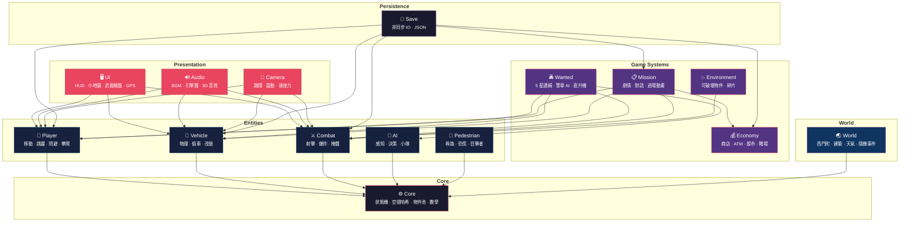

<div align="center">

# 🏝️ 島嶼狂飆 Island Rampage

**以台灣為舞台的 3D 開放世界動作冒險遊戲**

*A GTA-style open-world action game set in Taiwan*

[](https://www.rust-lang.org/)
[](https://bevyengine.org/)
[](/)
[](/)
[](LICENSE)

</div>

---

## 🎮 遊戲簡介

在霓虹燈閃爍的台灣街頭，體驗最道地的開放世界冒險。從西門町的繁華街道開始，駕駛各式車輛、與警察周旋、完成任務、累積財富。

## ✨ 功能總覽

| 系統          | 內容                                                  |
|:------------|:----------------------------------------------------|
| ⚔️ **戰鬥**   | 多種槍械（含狙擊槍/RPG）、近戰連擊（4 段 combo）、爆炸物（手榴彈/汽油彈/C4/火箭彈）、掩體系統、車上射擊、自動瞄準、隱匿擊殺 |
| 🚗 **載具**   | 轎車/機車/巴士/計程車/水上載具、偷車動畫、6 項改裝、氮氣加速、碰撞損壞 + 視覺變形系統            |
| 🚔 **通緝**   | 5 星等級、警車追逐 AI、警用直升機（探照燈）、路障、投降/逮捕、目擊者報警             |
| 🌆 **開放世界** | 西門町場景、可破壞環境、行人 AI（恐慌波傳播）、NPC 交通系統、隨機事件              |
| ☁️ **天氣**   | 日夜循環、晴/陰/雨/霧/暴風雨/沙塵暴、動態光照、霓虹燈閃爍                     |
| 💰 **經濟**   | 金錢系統、商店、ATM、股票市場（6 支台股）、賭場（21 點/拉霸）、企業投資            |
| 🎯 **任務**   | 劇情任務（多章節）、對話系統、過場動畫、NPC 關係、支線任務                     |
| 🔊 **音效**   | 車內廣播電台（8 頻道）、引擎聲、武器音效、3D 空間音效                       |
| 📱 **手機**   | 聯絡人、任務日誌、地圖、設定、股市 App、車輛改裝商店                        |
| 🏃 **角色**   | 3 角色切換（阿龍/小美/阿財）、技能系統、攀爬/跑酷、游泳                      |
| 💾 **存檔**   | 3 個存檔欄位、非同步 IO、JSON 序列化、自動存檔                        |

## ⚙️ 技術棧

| 項目 |                  技術                  |
|:--:|:------------------------------------:|
| 語言 |          Rust 2021 Edition           |
| 引擎 | [Bevy](https://bevyengine.org/) 0.17 |
| 物理 |          bevy_rapier3d 0.32          |
| 風格 |             Low-poly 霓虹風             |

**📊 專案規模**

- 📁 252 個 `.rs` 檔案
- 📝 86,729 行代碼
- ✅ 817 個單元測試（100% 通過）
- 🔍 0 clippy warnings

## 🏗️ 架構



## 🚀 開發

### 環境需求

- Rust 1.75+
- 支援 Vulkan / Metal / DX12 的顯示卡

### 運行

```bash
cargo dev                # 開發模式（含 World Inspector）
cargo run                # 開發模式
cargo run --release      # 發布模式（最佳效能）
cargo test               # 執行 817 個單元測試
cargo clippy             # 靜態分析
```

## 📅 開發進度

### ✅ 已完成

- [x] **Phase 1** — 核心系統（玩家控制、經濟、存檔）
- [x] **Phase 2** — 戰鬥系統（射擊、掩體、爆炸物）
- [x] **Phase 3** — 通緝系統（警車 AI、路障、逮捕）
- [x] **Phase 4** — 開放世界（隨機事件、可破壞環境、偷車）
- [x] **Phase 5** — 進階功能（直升機、近戰、車輛改裝、效能優化）
- [x] **Phase 6** — 代碼品質（模組拆分、複雜度優化、配置提取）
- [x] **Phase 7** — 架構重構（God Module 拆分、元件分解、註解審查）
- [x] **Phase 8** — 測試覆蓋（4 大核心模組新增 94 個單元測試）
- [x] **Phase 9** — 代碼品質強化（壞氣味修復、pedantic lint 清理、死碼移除）

### 🆕 近期完成

- [x] 全專案 clippy pedantic lint 清理（1,517 warnings → 0）
- [x] 全 codebase 壞氣味修復（God Function 拆分、SystemParam 重構）
- [x] 移除 31 個驗證過的死碼欄位與常數（-304 行）
- [x] CI 條件式磁碟清理（空間不足 2GB 時自動 cargo clean）
- [x] 狙擊槍 + RPG 武器（狙擊鏡 FOV、投射物飛行 + 碰撞爆炸）
- [x] 隱匿擊殺系統（三階段動畫、背後判定、10 倍傷害）
- [x] 玩家游泳系統（水中移動、潛水、憋氣、溺水）
- [x] 載具視覺變形（6 部位碰撞變形 + 材質暗化）
- [x] 手機系統（聯絡人、任務日誌、地圖、設定、股市）
- [x] 車內廣播電台（8 頻道 + 快捷切換）
- [x] 股票市場系統（6 支台灣主題股票 + 手機交易 UI）
- [x] 攀爬 / 跑酷
- [x] 多角色切換（3 角色 + 衛星動畫）
- [x] 賭場系統（21 點 + 拉霸機）
- [x] 車輛改裝商店手機 App（6 項改裝類別 UI）

### 🔮 未來規劃

- [ ] 🌐 多人連線
- [ ] 🏠 房屋購買 / 室內場景
- [ ] 📖 更多劇情任務章節

## 📄 授權

Copyright &copy; 2024-2026 Neal Chen. All Rights Reserved.

本軟體為專有軟體，未經授權不得複製、修改或散布。

---

<div align="center">

**Made with ❤️ in Taiwan 🇹🇼**

</div>
