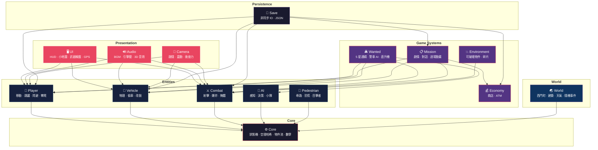

<div align="center">

# 🏝️ 島嶼狂飆 Island Rampage

**以台灣為舞台的 3D 開放世界動作冒險遊戲**

*A GTA-style open-world action game set in Taiwan*

[](https://www.rust-lang.org/)
[](https://bevyengine.org/)
[](/)
[](LICENSE)

</div>

---

## 遊戲簡介

在霓虹燈閃爍的台灣街頭，體驗最道地的開放世界冒險。從西門町的繁華街道開始，駕駛各式車輛、與警察周旋、完成任務、累積財富。

## 功能總覽

| 系統       | 內容                                     |
|----------|----------------------------------------|
| **戰鬥**   | 多種槍械、近戰武器、爆炸物（手榴彈/汽油彈/C4）、掩體系統、車上射擊    |
| **載具**   | 轎車/機車/巴士/計程車、偷車動畫、6 項改裝、氮氣加速、損壞系統      |
| **通緝**   | 5 星等級、警車追逐 AI、警用直升機（探照燈）、路障、投降/逮捕      |
| **開放世界** | 西門町場景、可破壞環境、行人 AI（恐慌波+目擊者報警）、交通系統、隨機事件 |
| **天氣**   | 日夜循環、晴/陰/雨/霧/暴風雨/沙塵暴、動態光照、霓虹燈閃爍        |
| **經濟**   | 金錢系統、商店、ATM                            |
| **任務**   | 劇情任務、對話系統、過場動畫、NPC 關係                  |
| **存檔**   | 非同步 IO、JSON 序列化                        |

## 技術棧

| 項目 |                  技術                  |
|:--:|:------------------------------------:|
| 語言 |          Rust 2021 Edition           |
| 引擎 | [Bevy](https://bevyengine.org/) 0.17 |
| 物理 |          bevy_rapier3d 0.32          |
| 風格 |             Low-poly 霓虹風             |

**規模**：140 個 .rs 檔案 · ~62,800 行 · 782 個單元測試

## 架構



## 開發

### 環境需求

- Rust 1.75+
- 支援 Vulkan / Metal / DX12 的顯示卡

### 運行

```bash
cargo run                # 開發模式
cargo run --release      # 發布模式（最佳效能）
cargo test               # 執行測試
cargo clippy             # 靜態分析
```

## 開發進度

### 已完成

- [x] **Phase 1** — 核心系統（玩家控制、經濟、存檔）
- [x] **Phase 2** — 戰鬥系統（射擊、掩體、爆炸物）
- [x] **Phase 3** — 通緝系統（警車 AI、路障、逮捕）
- [x] **Phase 4** — 開放世界（隨機事件、可破壞環境、偷車）
- [x] **Phase 5** — 進階功能（直升機、近戰、車輛改裝、效能優化）
- [x] **Phase 6** — 代碼品質（模組拆分、複雜度優化、配置提取）
- [x] **Phase 7** — 架構重構（God Module 拆分、元件分解、註解審查）
- [x] **Phase 8** — 測試覆蓋（4 大核心模組新增 94 個單元測試）

### 未來規劃

- [ ] 手機系統（任務接取、聯絡人、GPS）
- [ ] 游泳 / 潛水
- [ ] 車內廣播電台
- [ ] 攀爬 / 跑酷
- [ ] 多角色切換

## 授權

Copyright &copy; 2024-2026 Neal Chen. All Rights Reserved.

本軟體為專有軟體，未經授權不得複製、修改或散布。

---

<div align="center">

**Made with ❤️ in Taiwan 🇹🇼**

</div>
